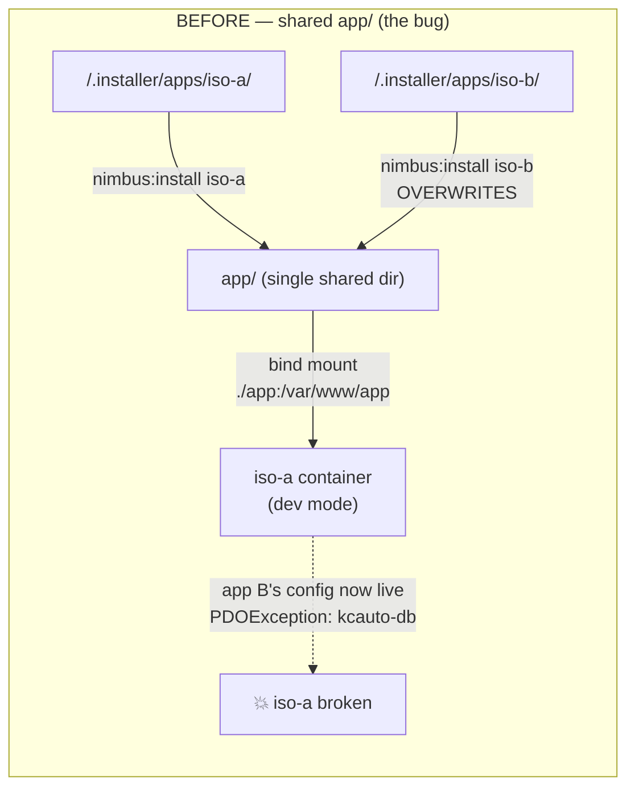
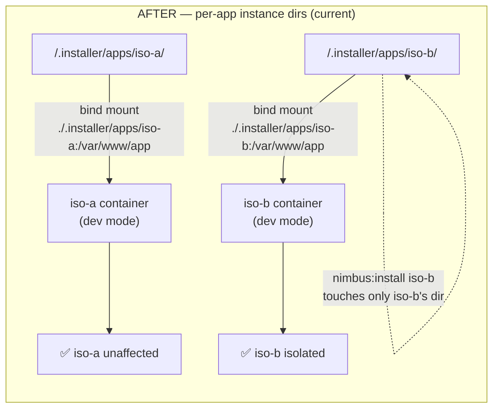

# Nimbus Framework Architecture Design

## Overview
Nimbus is a modular PHP MVC framework designed to support multiple themed applications with Event-Driven Ansible (EDA) integration. Each app runs in a containerized environment with its own database, application server, and EDA rulebook processor.

Nimbus uses a sophisticated Nimbus CLI system built on top of Composer for
   managing containerized applications. Here's how it works:

  Nimbus CLI Commands

  The system provides these composer commands via ApplicationTasks.php:

  1. App Creation:
    - composer nimbus:create <app-name> - Creates new app from template
    - composer nimbus:create-with-eda <app-name> - Creates app with Event-Driven Ansible
    - composer nimbus:create-eda-keycloak <app-name> - Creates app with EDA + Keycloak SSO
  2. App Management:
    - composer nimbus:install <app-name> - Generates container configuration
    - composer nimbus:up <app-name> - Starts containers
    - composer nimbus:down <app-name> - Stops containers
    - composer nimbus:status - Shows app status
    - composer nimbus:delete <app-name> - Deletes app
  3. Feature Addition:
    - composer nimbus:add-eda <app-name> - Adds Event-Driven Ansible
    - composer nimbus:add-keycloak <app-name> - Adds Keycloak SSO

  Architecture

  1. App Templates: Stored in .installer/_templates/nimbus-app-php/
  2. App Storage: Created apps live in .installer/apps/<app-name>/
  3. Container Stack: Each app gets:
    - App container: PHP/Apache with your MVC framework
    - Database container: PostgreSQL with auto-schema loading
    - EDA container (optional): Event-Driven Ansible for webhooks/automation
    - Keycloak containers (optional): SSO authentication
  4. Dynamic Configuration:
    - Generates unique ports per app (based on app name hash)
    - Creates isolated networks per app
    - Manages volumes for data persistence
    - Handles health checks and dependencies

  Workflow

  1. Create app → Copies template, replaces placeholders
  2. Install app → Generates <app-name>-compose.yml
  3. Start app → Runs podman-compose up
  4. App runs with its own isolated stack

  The system uses PSR-7 with named variables (not php://input) and follows a clean MVC pattern
   with Mustache templates, PDO database access, and proper separation of concerns.

## Core Components

### 1. Namespace Structure
```
Nimbus\
├── Core\
│   ├── Application.php         # Main application bootstrap
│   ├── Container.php          # Dependency injection container
│   └── Config.php             # Configuration manager
├── Controller\
│   ├── AbstractController.php  # Base controller class
│   ├── ControllerInterface.php # Controller contract
│   └── ControllerResolver.php  # Controller resolution logic
├── View\
│   ├── ViewInterface.php       # View renderer interface
│   ├── TemplateEngine\
│   │   ├── EngineInterface.php # Template engine contract
│   │   ├── MustacheEngine.php  # Mustache implementation
│   │   └── TwigEngine.php      # Future: Twig implementation
│   └── ViewManager.php         # View management & rendering
├── Database\
│   ├── ConnectionInterface.php # Database connection contract
│   ├── PDOConnection.php      # PDO implementation
│   ├── QueryBuilder.php       # Query builder abstraction
│   └── Repository\
│       └── AbstractRepository.php # Base repository pattern
├── Router\
│   ├── RouterInterface.php    # Router contract
│   ├── FastRouteAdapter.php   # FastRoute implementation
│   └── RouteCollector.php     # Route collection logic
└── App\
    ├── AppManager.php         # App installation/management
    ├── AppConfig.php          # App-specific configuration
    └── ContainerConfig.php    # Container orchestration

```

### 2. Controller Abstraction

```php
<?php
namespace Nimbus\Controller;

abstract class AbstractController
{
    protected $container;
    protected $view;
    protected $db;
    protected $config;
    
    public function __construct($container)
    {
        $this->container = $container;
        $this->view = $container->get('view.manager');
        $this->db = $container->get('db.connection');
        $this->config = $container->get('config');
    }
    
    protected function render(string $template, array $data = []): string
    {
        return $this->view->render($template, $data);
    }
    
    protected function json(array $data, int $status = 200): void
    {
        header('Content-Type: application/json');
        http_response_code($status);
        echo json_encode($data);
    }
    
    protected function redirect(string $url): void
    {
        header("Location: $url");
        exit;
    }
}
```

### 3. View/Renderer Abstraction

```php
<?php
namespace Nimbus\View;

class ViewManager
{
    private $engine;
    private $config;
    
    public function __construct(TemplateEngine\EngineInterface $engine, array $config)
    {
        $this->engine = $engine;
        $this->config = $config;
    }
    
    public function render(string $template, array $data = []): string
    {
        // Add global view data
        $data = array_merge($this->getGlobalData(), $data);
        return $this->engine->render($template, $data);
    }
    
    public function setEngine(TemplateEngine\EngineInterface $engine): void
    {
        $this->engine = $engine;
    }
}
```

### 4. Database Abstraction

```php
<?php
namespace Nimbus\Database;

class PDOConnection implements ConnectionInterface
{
    private $pdo;
    private $config;
    
    public function __construct(array $config)
    {
        $this->config = $config;
        $this->connect();
    }
    
    public function query(string $sql, array $params = []): \PDOStatement
    {
        $stmt = $this->pdo->prepare($sql);
        $stmt->execute($params);
        return $stmt;
    }
    
    public function transaction(callable $callback)
    {
        $this->pdo->beginTransaction();
        try {
            $result = $callback($this);
            $this->pdo->commit();
            return $result;
        } catch (\Exception $e) {
            $this->pdo->rollBack();
            throw $e;
        }
    }
}
```

### 5. App Management System

```php
<?php
namespace Nimbus\App;

class AppManager
{
    private $installerPath;
    private $targetPath;
    
    public function createApp(string $name, array $config): void
    {
        // Create app directory structure
        $this->createDirectoryStructure($name);
        
        // Generate app configuration
        $this->generateAppConfig($name, $config);
        
        // Setup container orchestration
        $this->setupContainers($name, $config);
        
        // Register app in composer.json
        $this->registerComposerScript($name);
    }
    
    public function installApp(string $name): void
    {
        $source = $this->installerPath . '/' . $name;
        $assets = $this->getAppAssets($name);
        
        foreach ($assets as $asset) {
            $this->copyAsset($asset['source'], $asset['target'], $asset['isFile']);
        }
    }
}
```

## Dev Mode: Per-App Instance Isolation

Beyond the containerized production stack, Nimbus supports a live-edit dev mode (`bin/nimbus dev <app>`) that bind-mounts an app's source into a running container so edits show up without a rebuild. Early versions of dev mode bind-mounted a single shared `app/` directory — installing or dev-running a *second* app overwrote the first app's served code/config out from under it, breaking the running container (e.g. `PDOException: could not translate host name "kcauto-db"` when app B's Postgres hostname leaked into app A's live config). This has since been fixed: **each app is served from its own `.installer/apps/<name>/` instance directory**, so multiple apps can run in dev mode simultaneously without colliding.





| Where | Old behavior | Current behavior |
|---|---|---|
| `AppManager::buildDevOverlay()` — `src/Nimbus/App/AppManager.php:1860` | `'./app:/var/www/app:Z'` | `'./.installer/apps/' . $appName . ':/var/www/app:Z'` |
| `Application::setupRoutes()` — `src/Nimbus/Core/Application.php:195-201` | only checked `app/CustomRoutes.php` | tries that, falls back to `<instance>/routes/CustomRoutes.php` |
| `bin/nimbus cmd_dev()` — `bin/nimbus:202-221` | installed into / guarded against the shared dir | no shared-dir logic left; `install` only fires to generate the compose file if missing |
| `AppManager::commitAppToTemplate()` — `src/Nimbus/App/AppManager.php:1178` | copied from live `app/` | copies from `.installer/apps/<name>/<asset>` back into `.installer/_templates/<type>/` |

Root `app/` and `<app>-compose.yml` still exist and are used by baked production images (materialized *inside* the image at build time) and the legacy `composer serve` path — but dev mode no longer reads or depends on the shared copy.

## App Configuration Structure

### App Definition (app.nimbus.json)
```json
{
    "name": "lkui",
    "version": "1.0.0",
    "type": "themed-app",
    "containers": {
        "app": {
            "build": ".",
            "ports": ["8080:8080"],
            "volumes": [".installer/lkui:/var/www/.installer/lkui:Z"]
        },
        "db": {
            "image": "postgres:14",
            "env_file": ".installer/lkui/database/.env",
            "volumes": [
                "./data:/var/lib/postgresql/data:Z",
                ".installer/lkui/database/schema.sql:/docker-entrypoint-initdb.d/schema.sql:Z"
            ]
        },
        "eda": {
            "image": "registry.redhat.io/ansible-automation-platform-24/de-minimal-rhel9:latest",
            "volumes": [
                "./eda/rulebooks:/rulebooks:Z",
                "./eda/playbooks:/playbooks:Z"
            ]
        }
    },
    "assets": {
        "views": {
            "source": ".installer/lkui/Views",
            "target": "app/Views"
        },
        "controllers": {
            "source": ".installer/lkui/Controllers",
            "target": "app/Controllers"
        },
        "models": {
            "source": ".installer/lkui/Models",
            "target": "app/Models"
        },
        "routes": {
            "source": ".installer/lkui/routes/CustomRoutes.php",
            "target": "app/CustomRoutes.php",
            "isFile": true
        }
    }
}
```

## Implementation Phases

### Phase 1: Core Nimbus Framework
1. Create Nimbus namespace and core classes
2. Move Bootstrap.php logic into Nimbus\Core\Application
3. Implement dependency injection container
4. Create base controller abstraction

### Phase 2: View System
1. Implement ViewManager with pluggable template engines
2. Create MustacheEngine adapter
3. Prepare for future template engine implementations
4. Move view resolution logic to Nimbus

### Phase 3: Database Abstraction
1. Create PDOConnection wrapper
2. Implement QueryBuilder for common operations
3. Add Repository pattern support
4. Create migration system

### Phase 4: App Management
1. Create AppManager for automated app installation
2. Generate container orchestration configs
3. Implement app scaffolding commands
4. Automate composer.json updates

### Phase 5: EDA Integration
1. Create EDA rulebook templates
2. Implement playbook management
3. Add webhook/event handlers
4. Create monitoring dashboards

## Benefits

1. **Modularity**: Swap components without affecting the entire system
2. **Reusability**: Share code between themed apps
3. **Scalability**: Each app runs in isolated containers
4. **Maintainability**: Clear separation of concerns
5. **Automation**: Simplified app creation and deployment
6. **EDA Power**: Event-driven automation built-in

## Migration Strategy

✅ **COMPLETED**: The migration to Nimbus is complete and working.

1. ✅ Created Nimbus namespace alongside existing code
2. ✅ Refactored all components into Nimbus
3. ✅ Updated apps to use Nimbus components
4. ✅ Maintained backward compatibility during transition
5. ✅ Created comprehensive migration guides

## Current Status (2025)

🎯 **Production Ready**: The Nimbus Framework is fully implemented and operational.

### What's Working Now:
- **Complete MVC Framework**: All core components implemented
- **Container Orchestration**: Multi-container app stacks with health monitoring
- **EDA Integration**: Full Ansible automation support
- **App Management**: Automated creation, installation, and lifecycle management
- **Template System**: Extensible app templates with placeholder replacement
- **CLI Tools**: All composer commands working with interactive modes

### Architecture Benefits Achieved:
1. ✅ **Modularity**: Components can be swapped without affecting the system
2. ✅ **Reusability**: Code is shared between themed apps
3. ✅ **Scalability**: Each app runs in isolated containers
4. ✅ **Maintainability**: Clear separation of concerns
5. ✅ **Automation**: Simplified app creation and deployment
6. ✅ **EDA Power**: Event-driven automation built-in

The Nimbus Framework has evolved beyond the original architectural design into a comprehensive containerized application generator with production-ready automation capabilities.